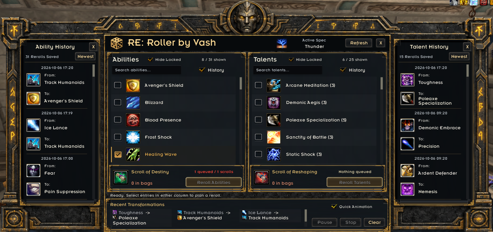

# RE: Roller by Vash

**Choose what changes. Protect what matters.**

A side-by-side ability and talent reroll planner for **Grimfall's custom World of Warcraft 3.3.5a client**, framed in the gold-and-stone Titan Reliquary interface.

[**Download 0.9.2-rc2**](https://github.com/BarronZeta/RE-Roller/releases/download/v0.9.2-rc2/RE-Roller-0.9.2-rc2.zip) · [All releases](https://github.com/BarronZeta/RE-Roller/releases) · [Installation](#installation) · [Report a bug](https://github.com/BarronZeta/RE-Roller/issues/new/choose)

> **Compatibility:** Grimfall only. This addon relies on Grimfall's custom classless APIs; it is not a Retail, Classic, or generic WotLK addon. The current public build is a **release candidate**, not a claim of compatibility with every client update.

*Live in-game capture from Grimfall, supplied by Vash. Both history panels are open and Hide Locked is enabled for abilities and talents. This screenshot shows the earlier Emblem typography; the current release uses WoW's built-in font.*

## What it does

- Browse your learned **Abilities** and **Talents** side by side, with search and hover tooltips.
- Select several entries and reroll them through a confirmed queue.
- Use **separate reroll buttons and scroll budgets** for abilities and talents.
- Right-click an entry to lock it against accidental selection. Locks are saved separately for each character and specialization slot.
- Turn on **Hide Locked** independently in either column to focus on the entries you want to change.
- Open scrollable **Ability History** and **Talent History** panels to review what rolled off and what replaced it. Hover either spell's icon or name for its tooltip.
- See your current custom specialization's name and icon when Grimfall provides them.
- Use **Quick Animation**, Pause/Resume, Stop, and a bounded Recent Transformations area.
- See fading, **text-only reroll announcements** with spell icons, without a notification box.
- Move and resize the planner; drag its small launcher anywhere on screen.

| Reroll type | Required item | Item ID |
| --- | --- | --- |
| Ability | Scroll of Destiny | 640 |
| Talent | Scroll of Reshaping | 639 |

The queue budgets one scroll per selected entry and checks the actual result before proceeding. It does not make rerolls free or guarantee a particular outcome.

## Installation

1. Close WoW.
2. Download **`RE-Roller-0.9.2-rc2.zip`** from [Releases](https://github.com/BarronZeta/RE-Roller/releases/tag/v0.9.2-rc2). Choose the named addon ZIP, not GitHub's automatic **Source code** archives.
3. Extract the **`GrimfallReroll`** folder into your Grimfall game's `Interface/AddOns` directory.
4. Check that the final path is `Interface/AddOns/GrimfallReroll/GrimfallReroll.toc`. Avoid nesting it inside another downloaded folder.
5. Start WoW and enable **RE: Roller by Vash** in the character-selection AddOns list.
6. Enter the game and type **`/rr`**, or click the dice launcher.

### Updating an existing installation

With WoW closed, back up your existing `GrimfallReroll` addon folder, then replace that folder with the one from the release ZIP. **Do not delete your `WTF` folder or `GrimfallRerollDB` saved variables.** Those contain your settings, protection locks, and history.

The internal folder remains **`GrimfallReroll`** for compatibility. Do not rename it to `RE-Roller`.

## Using the planner

1. Search or scroll to the ability or talent you want to change.
2. **Left-click** its row or checkbox to select it.
3. **Right-click** anything you want to keep to lock it. Locking is immediate; unlocking asks for confirmation.
4. Check the selected count and available scrolls in that column.
5. Click **Reroll Abilities** or **Reroll Talents**. The other column's selection and scroll budget do not block that button.

**Pause** waits for any request already sent and pauses subsequent requests. Click it again to resume. **Stop** or closing the planner prevents further requests; an already submitted reroll cannot be recalled. Its confirmed result can still be recorded.

**Clear** clears the current selection. It does not erase history or remove protection locks.

### Hide Locked

Use the checkbox beside either section heading to hide that section's protected entries. Both filters default to off, are remembered independently, and work together with search. Turn a filter off to see and unlock a protected entry again.

Protection locks belong to each **character + realm + specialization slot**. The Hide Locked switches themselves are display preferences shared across specializations; they always filter using the active specialization's locks.

### History and announcements

The **History** checkbox in each column opens its corresponding side panel. Scroll with the mouse wheel or scrollbar; **Newest** returns to the latest entry. Each confirmed record shows **From** and **To**, with separate spell tooltips.

History retains the most recent **100 confirmed rerolls total per character**, across abilities, talents, and specializations. The footer shows the latest three transformations.

Confirmed rerolls appear in a fading result notice above/in front of the planner, with spell icons and old-to-new names in WoW's built-in font. The notice has no background or border; a thin outline and shadow keep the text readable. Rapid results appear one at a time without slowing down rerolls. Long names wrap, and closing the planner clears the temporary notices without deleting history.

### Commands

| Command | Action |
| --- | --- |
| `/rr` | Open or close the planner |
| `/rr stop` | Stop sending further reroll requests |
| `/rr icon` | Restore the launcher to its default position |
| `/rr diagnose` | Check required Grimfall APIs and show the current diagnostic status |
| `/rr history` | Print up to 20 recent history entries in chat |

`/reroller`, `/rerolls`, and `/grr` are aliases for `/rr`.

## Fonts and requirements

There are **no required companion addons**. RE: Roller uses **Friz Quadrata**, included with WoW, throughout the planner. Bundled **PT Sans** is the fallback if the game font cannot load; its license is included. Emblem and other addons' font registrations are no longer used. No global game fonts or other addons' files are changed.

Quick Animation only shortens the presentation for this addon's pending reroll. It preserves the client's result callbacks and does not bypass server confirmation or scroll costs.

## Troubleshooting and support

- **Nothing appears in the AddOns list:** check the folder nesting and the `.toc` path above.
- **A locked entry disappeared:** turn off Hide Locked and clear the search box.
- **The reroll button is unavailable:** check that you selected unlocked entries, have enough of that column's scrolls in your bags, are alive and out of combat, and have no pending result.
- **The queue stops:** read the planner's status line, then use `/rr diagnose`. The addon stops on uncertain results, server errors, or changes to your build instead of blindly sending another request.
- **The font differs from the preview:** the live screenshot shows the earlier Emblem font. The current release deliberately uses WoW's built-in font instead.

[Report a bug](https://github.com/BarronZeta/RE-Roller/issues/new/choose) with your version, reproduction steps, and the exact error/status message. Screenshots help; crop private chat or account details. Do not upload your whole `WTF` folder or account files.

## Development

The addon source is in `GrimfallReroll/`. See [Development and testing](docs/DEVELOPMENT.md), [Contributing](CONTRIBUTING.md), and [Changelog](CHANGELOG.md).

Tests use mocked game APIs and never connect to a game server or consume scrolls. Offline tests and previews do not replace in-game verification on Grimfall.

## License and credits

Original code, tests, scripts, and documentation are licensed under [MIT](LICENSE), copyright 2026 Vash. Bundled ParaType fonts remain under their included SIL Open Font License. See [Third-party and asset notes](GrimfallReroll/THIRD_PARTY_NOTICES.txt).

RE: Roller is a community addon by Vash. It is not an official Blizzard product and does not claim endorsement by Blizzard or Grimfall.
